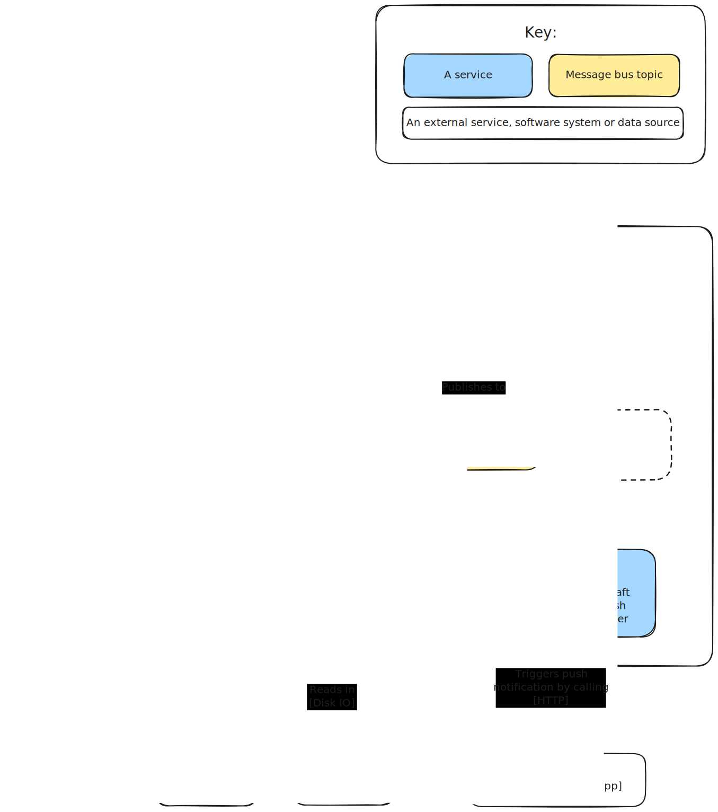

# Aircraft

Combines local ADS-B data with other data sources and notifies about interesting aircraft.

## About the project


### Key features

- Triggers Push Notifications when interesting aircraft are spotted by tar1090
- Keeps track of all seen aircraft (in progress)
- Displays statistics about aircraft seen (to do)

### Diagram



### Roadmap / TO DO list

- [x] Re-implement`discoverer` service using Go
  - [x] Publish aircraft when found
- [x] Re-add NATS
- [x] Implement `enricher` service
  - [x] Enrich with HexDB data
  - [x] Enrich with PlaneAlertDb data (i.e. whether it's an interesting aircraft and why)
  - [x] What should happen if an enricher fails? Should it continue? Later enricher may be able to fill in gaps
  - [ ] Use Context appropriately with enrichers (e.g. set deadline, cancel gracefully)
  - [ ] Investigate any other potential data sources
- [x] Implement `evaluator` service
  - [x] Implement logic to identify interesting aircraft
- [x] Implement `notifier` service
  - [x] Publish notifications using Pushover
- [ ] Add Postgres
- [ ] Add `historian` service
- [ ] Add `stats` service
- [ ] Add a `monitoring` service to keep track of enrichment failures (could use this to compare sources and find backup enrichers for when one source doesn't have any details)
- [ ] Other / refactoring / future
  - [ ] Try out https://github.com/caarlos0/env
  - [ ] Back-off approach for enrichers if they fail with certain error codes (not 404)
  - [ ] Add a "system context" C4-style diagram
  - [ ] Add some architecture docs explaining design choices

## Getting started

### Pre-requisites

- A Kubernetes (K8s) cluster
- [kubectl](https://kubernetes.io/docs/tasks/tools/) or your preferred K8s tool
- A K8s namespace of your choosing e.g. `aircraft`
  ```bash
  kubectl create namespace aircraft
  ```
- [Install DevSpace](https://www.devspace.sh/docs/getting-started/installation)
- Install NATS on your K8s cluster
  ```bash
  helm repo add nats https://nats-io.github.io/k8s/helm/charts/
  helm repo update
  helm install my-nats nats/nats
  ```
- A tar1090 API endpoint available e.g. by running [Readsb](https://github.com/wiedehopf/readsb) on your local network

#### My ADS-B setup

- An [antenna that can pick up 1090MHz](https://www.amazon.co.uk/Bingfu-Magnetic-20-1300MHz-Compatible-Whistler/dp/B08YNF3DK7)
- An [adapter](https://www.amazon.co.uk/Coaxial-Adapter-Converter-Connectors-Wireless/dp/B0B4SDLLJ6) if the antenna has a different connector to the dongle
- A [USB SDR ADS-B Receiver Dongle](https://thepihut.com/products/flightaware-pro-stick-plus-usb-sdr-ads-b-receiver)
- A Ubuntu Server VM with access to a USB port
- [Readsb](https://github.com/wiedehopf/readsb) installed directly onto Ubuntu

### Installation

1. Clone the repository
   ```bash
   git clone https://github.com/corinm/aircraft-go.git
   ```
2. Create and populate `.env` files in each service (refer to `.env.example` files)
3. Ensure you are in your chosen namespace
   ```
   devspace use namespace
   # Select your namespace from the drop-down
   ```
4. Optional: For a production-like deployment use devspace's deploy command
   ```bash
   devspace deploy
   ```
5. Optional: To develop a specific service `cd` into the service directory and use devspace's dev command
   ```bash
   cd ./notifier
   devspace dev
   ```

### Usage

- Polling for aircraft will start automatically when the `discoverer` starts up
- In future there will be API endpoints and a dashboard to view aircraft data and statistics

## Tests

### Testing strategy

This is a personal project I'm using to learn and experiment. I want to be able to make changes as easily as possible, therefore I'm intentionally keeping automated testing very minimal for now. I’ll add tests where they make sense and where they help me understand or validate something specific, but I’m not aiming for the type of test coverage I'd expect from production-grade software.

### Running unit tests

Currently only the `enricher` service has unit tests

```bash
make unit-tests
```

## Acknowledgements

- Readme structure based on [Best-README-Template](https://github.com/othneildrew/Best-README-Template/tree/main)
- AI-generated artwork created using [Perchance](https://perchance.org/ai-text-to-image-generator)
