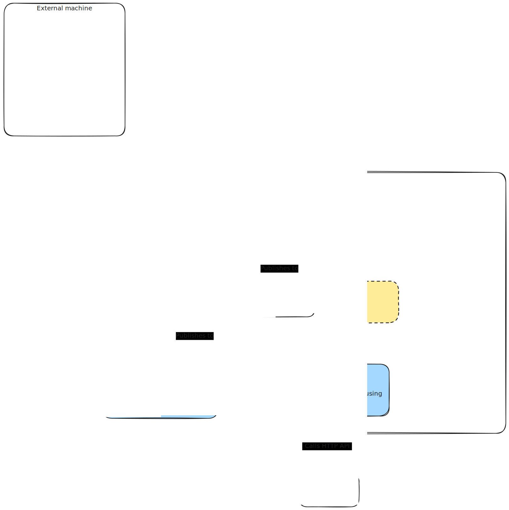

# Aircraft

Combines local ADS-B data with other data sources and notifies about interesting aircraft

## Overview

### Key features

- Triggers Push Notifications when interesting aircraft are spotted by tar1090
- Keeps track of all seen aircraft

### Diagram



## Getting started

### Using devspace

Install NATS

```bash
helm repo add nats https://nats-io.github.io/k8s/helm/charts/
helm repo update
helm install my-nats nats/nats
```

```bash
cd discoverer
devspace dev
```

## TODO list

- [x] Re-implement`discoverer` service using Go
  - [x] Publish aircraft when found
- [x] Re-add NATS
- [ ] Implement `enricher` service
  - [x] Enrich with HexDB data
  - [ ] Enrich with PlaneAlertDb data (i.e. whether it's an interesting aircraft and why)
  - [ ] Investigate any other potential data sources
- [ ] Implement `evaluator` service
  - [ ] Implement logic to identify interesting aircraft
- [ ] Re-implement `notifier` service in Go
  - [ ] Publish notifications using Pushover
